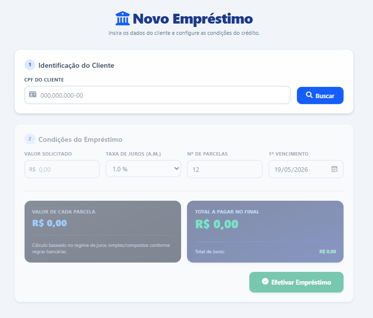

# 🎨 Desafio Front-end: Tela de Simulação de Empréstimos

Bem-vindo ao projeto prático de interface! Neste desafio, você será responsável por construir o **Front-end** de uma tela de **Simulação de Empréstimo Bancário**. 

O foco absoluto deste exercício é a **experiência do usuário (UX), a responsividade do layout e a lógica de programação lógica em JavaScript**.

> 📌 **Atenção:** Por enquanto, este sistema **não vai consumir nenhuma API externa ou Banco de Dados**. Toda a simulação e busca de dados de clientes devem acontecer diretamente na memória do navegador (usando dados fictícios em JavaScript).

---

## 💻 1. O que deve ser Implementado?

Você deve construir uma interface em um **único arquivo** (contendo o HTML, CSS e JavaScript) que execute o seguinte fluxo de uso:

### 🔹 Passo 1: Identificação do Cliente (Busca Simulada)
* Um campo de texto para o usuário digitar o **CPF do Cliente** (obrigatório ter máscara dinâmica `000.000.000-00` enquanto o usuário digita).
* Um botão **"Buscar"**.
* **Como deve funcionar:** Ao clicar em buscar, o JavaScript deve validar se o CPF foi digitado por completo. Se sim, ele deve simular que encontrou o cliente no sistema, exibindo o Nome dele na tela e preenchendo as contas bancárias disponíveis.

### 🔹 Passo 2: Seleção da Conta Bancária
* Exibir um campo de seleção (`<select>`) que liste as contas fictícias vinculadas a esse cliente (ex: *Agência 0001 | Conta 10245-8 (Corrente)*).
* O cliente pode ter mais de uma conta cadastrada no seu código JavaScript, permitindo a seleção de qualquer uma delas.

### 🔹 Passo 3: Parâmetros do Crédito e Cálculo em Tempo Real
A tela deve disponibilizar os seguintes campos para o cálculo:
1.  **Valor Solicitado:** Campo numérico onde o usuário digita quanto quer emprestado.
2.  **Taxa de Juros ao Mês:** Uma caixa de lista (dropdown) obrigatoriamente travada com três opções de escolha: **1.0%**, **2.0%** ou **3.0%**.
3.  **Quantidade de Parcelas:** Quantas parcelas o cliente deseja para pagar.
4.  **Data do Primeiro Vencimento:** Um campo de calendário (`date`) para escolher quando vence a primeira parcela.

---

## 📜 2. Regras de Interface e Comportamento Dinâmico

Para que o seu projeto seja considerado aprovado, os seguintes critérios serão avaliados:

* **[Regra 1] Bloqueio de Interface:** Toda a área de configuração do empréstimo (valores, juros, parcelas e botão de efetivar) deve iniciar **completamente bloqueada (desabilitada)**. Ela só pode ser liberada para edição após o usuário digitar um CPF e clicar em "Buscar".
* **[Regra 2] Cálculo Instantâneo:** O aluno não deve precisar clicar em nenhum botão para calcular. Conforme ele altera o valor, muda a taxa de juros ou mexe na quantidade de parcelas, o JavaScript deve capturar a mudança na hora e atualizar o visor com:
    * O valor de cada parcela individual.
    * O **Valor Total Final a Pagar** (Valor solicitado + Juros).
    * O valor total acumulado apenas de juros.
* **[Regra 3] Rigor Matemático:** O cálculo deve simular o sistema financeiro real (Juros Compostos / Tabela Price).
* **[Regra 4] Responsividade:** A tela deve ser construída pensando em múltiplos dispositivos. Teste o layout simulando a tela de um celular (os blocos devem empilhar verticalmente de forma elegante) e de um computador (os blocos podem se expandir lado a lado).

---

## 🛠️ Tecnologias Recomendadas (somente pode usar essas)

Para garantir agilidade no desenvolvimento e entrega em arquivo único, utilize:
* **Estrutura:** HTML5 limpo e semântico.
* **Estilização:** CSS PURO.
* **Dinamismo:** JavaScript puro

---
🚀 *Boa sorte! Foque nos detalhes visuais, nos estados dos botões (hover/active) e garanta que o cálculo mude instantaneamente na tela ao alterar os números.*